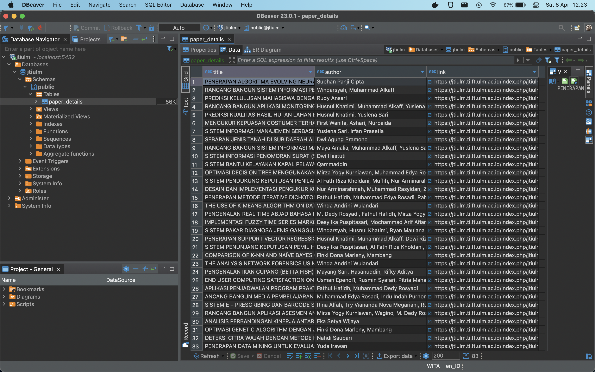
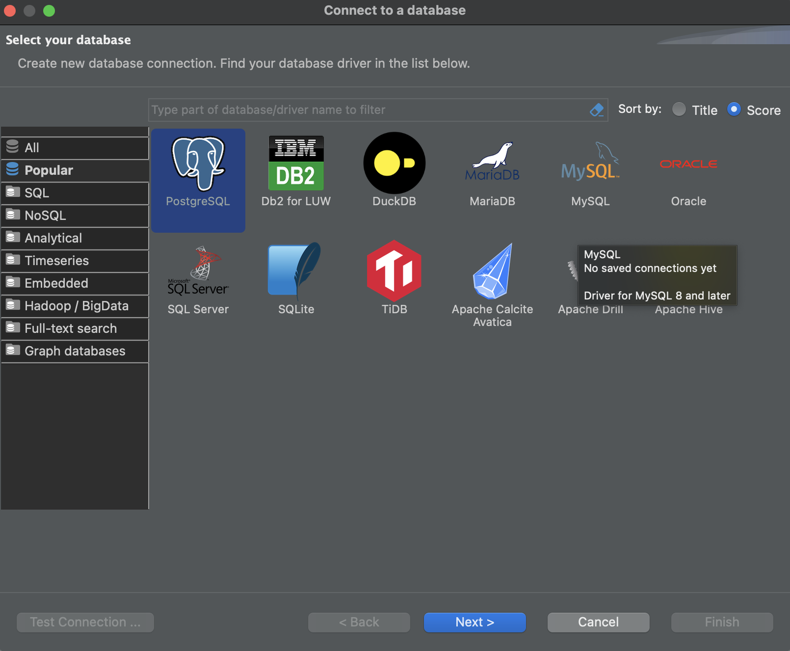
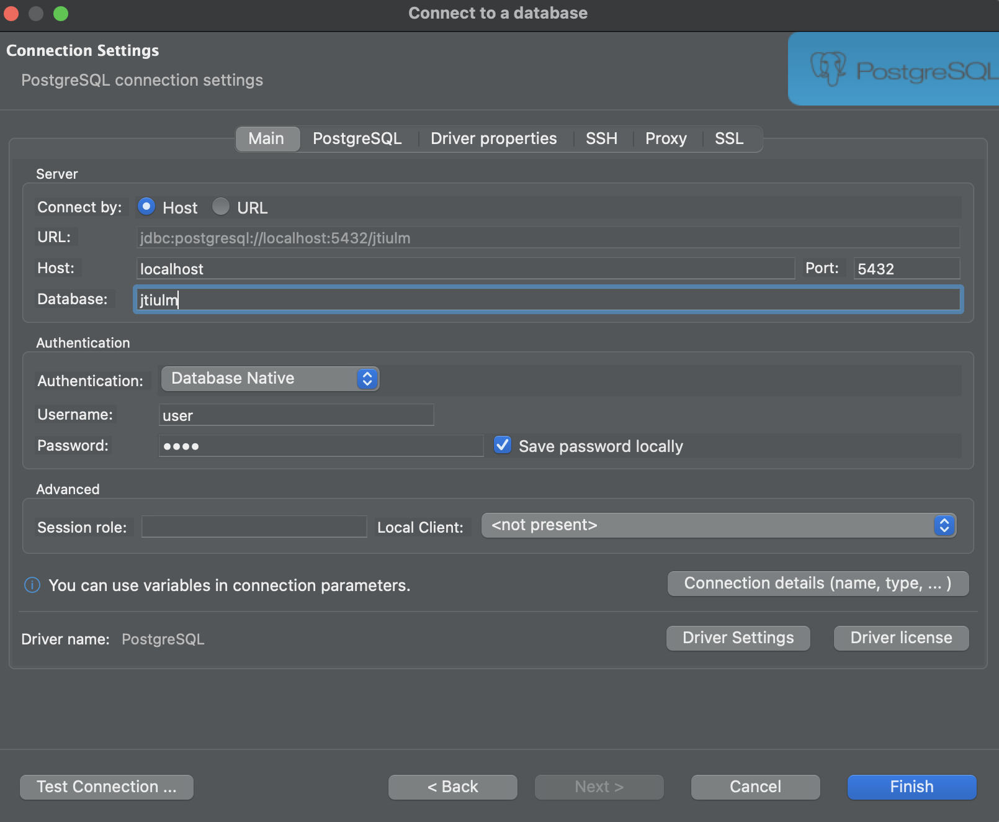
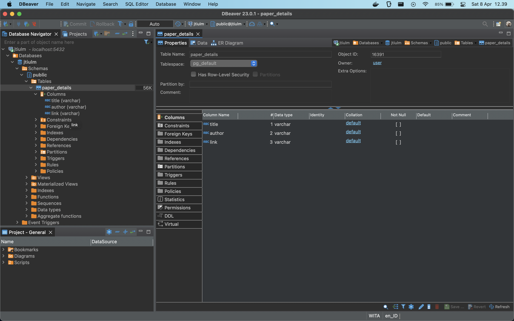

## INGEST PAPER DETAILS JTIULM
- python 3.9
- postgreSQL inside docker-compose 2.15.1 (optional) or you can install postgresSQL without docker and you can change paramater DB on **script.py** with your postgresSQL parameter on your local.
```
con = psycopg2.connect(
        database="YOUR_DB",
        user="YOUR_USER",
        password="YOUR_PASSWORD",
        host="YOUR_HOST")
```

## How to use
- clone this repo.
- install python package dependencies using `pip install -r requirements.txt`.
- run the docker compose with `docker-compose up -d`
- after that just run `python3 script.py`

## Access the database using DBeaver

- Download DBeaver
- Open DBeaver and create new connection and choose PostgreSQL

- Fill the blank field with `username = user`, `password = root`, `port = 5432`, `database = jtiulm` and press `test connection` if success press `finish`

- Table directory can be access based on pic below



